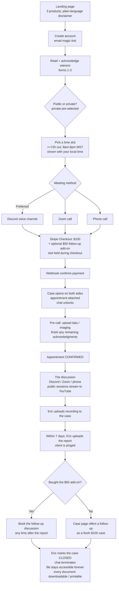

# TheBroScientist Neuro Advocacy — Product Spec v1

> **Repo:** `ebleach2010/Pocket-Advocate` · **Status:** SPEC — no code built yet.
> This document is the single source of truth for what v1 is. Eric reviews `FLOW.html`
> (the phone-readable version of this spec); builders work from this file.
> **Nothing here is legal advice.** Section B is a structure for a real lawyer to review
> before the first paying client.

---

## A. What this is

A paid **patient-advocacy** service run by Eric, serving clients in the
**United States only**. Advocates help people navigate their medical journey —

> ✅ **Amended (2026-07-12): the service also serves Canada.** Eric's call — he
> is not bound by medical licensing law for advocacy work, has safeguard
> documents in place, and operates under the LLC. All app copy (landing,
> sign-in attestation, waivers, legal footers, email footer) now says US and
> Canada. Canadian privacy law (PIPEDA) is therefore in scope — added to the
> lawyer-review list below.

organize their story, understand their labs and imaging in plain language, prepare
questions for their doctors, and find next steps. It is built on deep personal knowledge
and lived experience.

**What it is explicitly NOT** (this language appears on the landing page, in the waiver,
and in the report footer):

- Not diagnosis. Not treatment. Not prescriptions.
- Not a doctor-patient relationship, and not a substitute for one.
- Not therapy, and not emergency care ("if this is an emergency, call 911").

### The product lineup

| Product | Price | What you get |
|---|---|---|
| **Advocacy Case** | **$100** one-time | A live video discussion with Eric going over your symptoms, labs, and medical journey; a private case file with uploads, the call recording, and live chat; and within **one week** of the call, a comprehensive written report/flow chart covering what was discussed, next steps, and anything Eric found since the conversation. |
| **Follow-up add-on** | **+$50**, offered **only at checkout** | A second schedulable discussion on the same case, bookable any time after your report lands. If you skip it and want a follow-up later, that's a fresh $100 case with the same full benefits — there is no discounted retro add-on. |
| **Pocket Advocate** | **$20/month** subscription | Round-the-clock access to the chat with Eric, with his live online status. **Eric replies on his own time, when he's available — response timing is never guaranteed, and that trade-off is stated plainly in the terms the subscriber accepts.** Entirely separate from cases; cancel anytime (access runs to the end of the paid period). |

### The public/private choice

Every case client makes an explicit election before paying:

> *"Other patients gain insight into their medical journey when live discussion of cases
> are presented. However, this is entirely optional depending on your privacy preferences."*

- **Private session** (the pre-selected, visually neutral default): the discussion happens
  only between the client and Eric. The recording lives only in their case file.
- **Public session**: the live discussion is **broadcast live on the TheBroScientist
  YouTube channel** so other patients can learn from it.

Design rules for this consent (see §B): it is its own screen, never bundled into the
purchase click; it is revocable up until the broadcast starts; and choosing private
never costs more or removes any benefit.

---

## B. Legal & consent framework  ⚠️ *for your lawyer to review — not legal advice*

**Why "HIPAA doesn't apply" is true but not the end of the story.** Eric is almost
certainly not a HIPAA covered entity (not a provider billing insurance, not a health
plan, not a clearinghouse). But the moment the service stores strangers' labs and
imaging, other law reaches it: the **FTC Health Breach Notification Rule** explicitly
covers non-HIPAA health apps and services; the FTC Act covers deceptive privacy
promises; and state laws (e.g. Washington's **My Health My Data Act**, California's
CCPA/CPRA) apply to consumer health data held by non-HIPAA businesses. US-only service
keeps Canadian privacy law (PIPEDA and provincial statutes) out of scope — the terms
should state the service is offered to US residents only.

> ✅ **Superseded (2026-07-12): Canada is in scope.** The terms now say US and
> Canada, so PIPEDA (and provincial statutes like Quebec's Law 25) apply to
> Canadian clients' data. Flag for the attorney reviewing the DRAFT documents
> before the first paying client.

Practical consequences baked into this spec: collect only what's needed, encrypt in
transit and at rest (Firebase does both), lock access down with security rules from day
one, have a written breach plan, and say honestly in the privacy notice what is stored,
where, and for how long.

**The unauthorized-practice-of-medicine line.** Advocacy and navigation are legal; the
service must never look like medicine. Every screen, the report template, and the waiver
use advocacy framing ("help you understand," "questions to bring to your doctor,"
"options to discuss with your care team") — never "diagnosis," "treatment plan," or
"medical advice." The disclaimer is load-bearing, not decorative: it appears at signup
(acknowledged), on the case page (persistent), and in the report footer.

**The acknowledgment-forms gate.** An appointment is not **confirmed** until every
required form is acknowledged. The form set:

1. **Service disclaimer & waiver** — what the service is/isn't (§A language), assumption
   of the advocacy relationship, limitation of liability.
2. **Privacy & data handling** — what's stored (uploads, recording, report, chat), where
   (Firebase, US region), who can see it (the client + Eric), retention, deletion
   rights, breach notification.
3. **Recording consent** — the session is recorded and stored in the case file. This
   satisfies two-party/all-party consent states (California, Washington, Florida, etc.)
   by getting written consent from everyone before any recording.
4. **Public/private election** — the §A choice, on its own screen, private pre-selected.
   Public consent is **revocable until the broadcast starts** (a "make my session
   private" button on the case page, live until call time).
5. **Pocket Advocate terms** (subscribers only) — the no-response-time-guarantee clause,
   plainly worded; not-medical-advice restated for chat content; cancel-anytime.

**Report disclaimer footer** (every generated report): advocacy summary, not a medical
record or medical advice; share it with your care team.

---

## C. The end-to-end flow

### Main case flow



### Flow rules

- **Pay at scheduling.** Picking a slot and paying are one flow. The slot is held for
  ~15 minutes while Stripe Checkout completes; if checkout is abandoned the hold expires
  and the slot frees.
- **72-hour minimum lead time**, enforced server-side. Bookable windows are **8am–6pm
  MST** (fixed Mountain anchor regardless of client timezone; the picker always shows the
  client's local equivalent next to the MST time).
- **A case cannot exist without a payment.** The case is created by the Stripe webhook,
  never by the client's browser.
- **Confirmation gate.** The appointment shows "pending" until all required forms are
  acknowledged; then it flips to "confirmed."
- **The meeting happens off-platform** — no video code in v1. The case page shows the
  Discord voice-channel link (default, badged **Preferred** — clients can stream their
  own camera there, so it works like any video meeting), or the Zoom link, or "we will
  call you at (number) — expect a call from (Eric's number)."
- **Public sessions**: Eric streams the call to the TheBroScientist YouTube channel
  (e.g. OBS capturing the Discord/Zoom call). The app's job is only the consent record
  and its revocation window.

### Pocket Advocate flow (parallel product)

Account → subscription terms (form 5, with the no-guarantee clause up front) → Stripe
subscription Checkout ($20/mo) → chat unlocks immediately, showing Eric's live online
status. Renewal, failed payment, and cancellation all flow through Stripe webhooks:
access ends at the end of the last paid period. Independent of any case.

### Edge paths (policies to finalize with Eric — see §H)

- **Refund/cancel by client**: proposed — full refund if canceled ≥72h before the slot;
  inside 72h, reschedule once free, no cash refund. *(Proposal, not decided.)*
- **No-show**: proposed — client no-show forfeits after 15 minutes but gets one free
  reschedule; Eric-side no-show always full refund or priority reschedule, client's choice.
- **Public-consent revoked before broadcast**: session proceeds privately; nothing else
  changes; the consent record keeps the history.
- **Payment succeeded but forms never finished**: appointment stays "pending"; automated
  reminder at 48h and 24h before; unresolved at call time → treated as a client
  reschedule.

---

## D. Screens

### Client side

1. **Landing** — what the service is (and is NOT), the three products with prices, the
   public-session pitch in Eric's framing, FAQ, "Book a case" / "Get Pocket Advocate."
2. **Account** — email magic-link sign-in (no passwords to support).
3. **Waiver flow** — forms 1–3, one per screen, scroll-to-end + explicit acknowledge.
4. **Public/private election** — its own screen, private pre-selected.
5. **Schedule & pay** — calendar of Eric's open slots (MST + local time shown), meeting
   method picker (Discord badged Preferred), then straight into Stripe Checkout with the
   optional $50 follow-up add-on as a line item.
6. **Checkout return** — success → "your case is open"; cancel → slot released, try again.
7. **Case dashboard** — the heart of the app: status timeline (paid → forms → confirmed
   → call → recording → report → closed), appointment card with join link/phone info and
   an add-to-calendar button, uploads area (labs/imaging: PDF, JPEG/PNG/HEIC, DICOM
   accepted as files), forms status, the recording, the report, and the **chat** with
   Eric's online indicator.
8. **Closed-case view** — same file, chat removed, a notice that the case is closed, and
   **Download / Print** on every document.
9. **Pocket Advocate** — subscription page (terms + subscribe) and the subscriber chat
   (Eric's online status, message history, manage/cancel subscription link to the Stripe
   customer portal).

### Eric side (admin, gated to Eric's account)

1. **Case list** — open cases with status badges and "report due in N days" counters.
2. **Case detail** — everything the client sees, plus: post the Discord/Zoom link or
   phone note, view/download uploads, upload the recording, upload the report (triggers
   the client ping), mark milestones, and **Close case**.
3. **Availability editor** — recurring weekly openings + one-off blocks, constrained to
   8am–6pm MST; shows what's booked.
4. **Chat inboxes** — case chats and Pocket Advocate subscriber chats in one place,
   newest activity first; Eric's presence is set automatically while the admin app is
   open (Tether's `onDisconnect` pattern).

---

## E. Data model & architecture

**Stack:** static web app (installable PWA) on **Cloudflare** + **Firebase**
(Auth/Firestore/Storage/RTDB) + **Stripe**, with **one Cloudflare Worker** as the only
server-side code. This reuses the exact hosting pattern the Tether repo already proves
out (`wrangler.jsonc` assets hosting, `_headers` no-store HTML, `_redirects`), and the
Firebase presence pattern from Tether's sync bridge. Unlike Tether this is a normal
small multi-file app — no single-9MB-file constraint.

| Concern | Choice | Why |
|---|---|---|
| Identity | **Firebase Auth**, email magic-link | Real accounts (strangers' medical data — Tether's pair-code trick is not acceptable here); passwordless = nothing for Eric to support. US-residency attestation at signup. |
| Cases, forms, chat messages, availability | **Firestore** | Structured queries (case lists, statuses), solid security rules. |
| Labs, imaging, recordings, reports | **Firebase Storage** | Real files with per-case access rules — never base64-in-database. |
| Presence (Eric online?) | **RTDB** `onDisconnect` | The one thing RTDB does better; identical to Tether's proven presence code. |
| Payments | **Stripe Checkout** (one-time + subscription mode) + customer portal | No card data ever touches the app. |
| Server logic | **Cloudflare Worker** | Stripe webhook receiver + the trust boundary (below). Fits Eric's existing wrangler deploy pipeline. |

**The Worker is the trust boundary.** Never trusted to the browser:

- Creating cases/appointments (only the Stripe `checkout.session.completed` webhook does).
- Scheduling rules: ≥72h lead time, 8am–6pm MST windows, slot uniqueness, the ~15-minute
  slot hold during checkout.
- Pocket Advocate access: granted/revoked from subscription webhooks (created, renewed,
  payment failed, canceled).

**Firestore shape (sketch):**

```
users/{uid}: email, name, role: "client" | "admin"
cases/{caseId}:
  clientUid, status: paid|forms|confirmed|awaiting_report|delivered|closed
  publicElection: { choice: "private"|"public", history: [...], revocableUntil }
  appointment: { startMST, method: "discord"|"zoom"|"phone", joinLink?, phone? }
  addOnFollowUp: bool, followUpAppointment?
  forms: { disclaimer: ts, privacy: ts, recording: ts, election: ts }
  files: [ { kind: upload|recording|report, storagePath, name, uploadedBy, ts } ]
  reportDueAt   // callEnd + 7 days, drives Eric's due-date counters
cases/{caseId}/chat/{msgId}: from, text, ts, readAt
subscriptions/{uid}: stripeCustomerId, status, currentPeriodEnd
subscriptions/{uid}/chat/{msgId}: from, text, ts, readAt
availability/{slotId}: startMST, state: open|held|booked, holdExpiresAt?, caseId?
presence (RTDB): /presence/eric: bool  (client apps read-only)
```

**Security rules, day one:** a client reads/writes only their own case and chat; admin
role reads all; Storage paths are per-case with the same check; availability is
world-readable, Worker-writable only; presence is admin-writable, world-readable.
No open test mode, ever — this is the single biggest do-differently vs. Tether.

**Notifications ("they get pinged"):** v1 = email (report delivered, appointment
confirmed, chat message while offline — batched) + in-app badges. Web push on iOS
requires a Home-Screen install (iOS 16.4+); wire it in a later phase, not v1.

---

## F. Costs & operations

| Item | Cost |
|---|---|
| Stripe, $100 case | 2.9% + 30¢ ≈ **$3.20** (+$1.45 on the $50 add-on) |
| Stripe, $20/mo subscription | ≈ 88¢ + Stripe Billing's small % per cycle |
| Firebase | Free tier comfortably covers launch volume; storage of recordings is the first thing that would ever cost real money (~$0.026/GB/mo) |
| Cloudflare | Free tier |
| Discord / Zoom | Free (Discord) / existing account (Zoom) |
| Domain | ~$10–15/yr |

**Human costs (the real ones):** the 7-day report SLA per case — the due-date counter on
the admin case list exists so this never silently slips — and the standing expectation
of Pocket Advocate replies. The no-guarantee clause protects Eric legally; to protect
his time, the subscriber chat shows an Eric-controlled expectation line ("Eric typically
replies within a few days") and subscriptions can be paused from his side.

---

## G. Build phases (future sessions)

1. **Phase 1 — Skeleton + money:** repo scaffold (Cloudflare config copied from Tether's
   pattern), Firebase project + Auth + security rules, landing, waiver flow, election
   screen, schedule-and-pay with the Worker + Stripe webhook, case created end-to-end.
2. **Phase 2 — The case file:** uploads to Storage, case dashboard timeline, admin case
   list/detail, availability editor, recording + report upload with the client ping.
3. **Phase 3 — Chat + Pocket Advocate:** case chat, presence, subscriber flow with
   subscription webhooks, closed-case behavior, email notifications.
4. **Phase 4 — Hardening:** security-rules audit, PWA install polish, print stylesheet
   for reports, **lawyer pass on all copy before the first paying client**.

---

## H. Open questions for Eric

1. **Refund/cancel + no-show policies** — the §C proposals need a yes/no.
2. **Slot length** (60 min? 90?) and how far ahead the calendar opens (2 weeks? 4?).
3. **Domain / public brand name** — "TheBroScientist Neuro Advocacy" with Pocket
   Advocate as the subscription's name?
   ✅ **Decided (2026-07-11): the web app is called "Pocket Advocate."** The $20/mo
   product is presented as the "Pocket Advocate subscription." Public sessions still
   broadcast on the TheBroScientist YouTube channel. Domain still open.
4. **Follow-up add-on details** — booking deadline after the report (e.g. within 60
   days)? Does the follow-up produce its own written summary, or is it summary-free?
5. **Discord logistics** — one persistent lobby channel vs. a fresh private channel per
   case? (Matters so a privacy-opted client never bumps into the next client. Fresh
   channel per case is recommended.)
6. **Merged or separate chats** when a Pocket Advocate subscriber also buys a case?
   (Recommended: separate — the case chat closes with the case; the subscriber chat
   lives as long as the subscription.)
   ✅ **Implemented as recommended (Phase 3, 2026-07-11): separate chats.**
